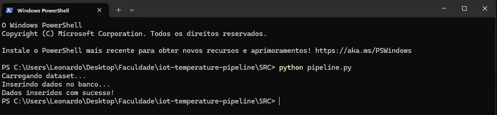
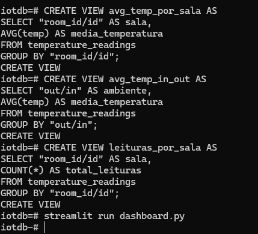
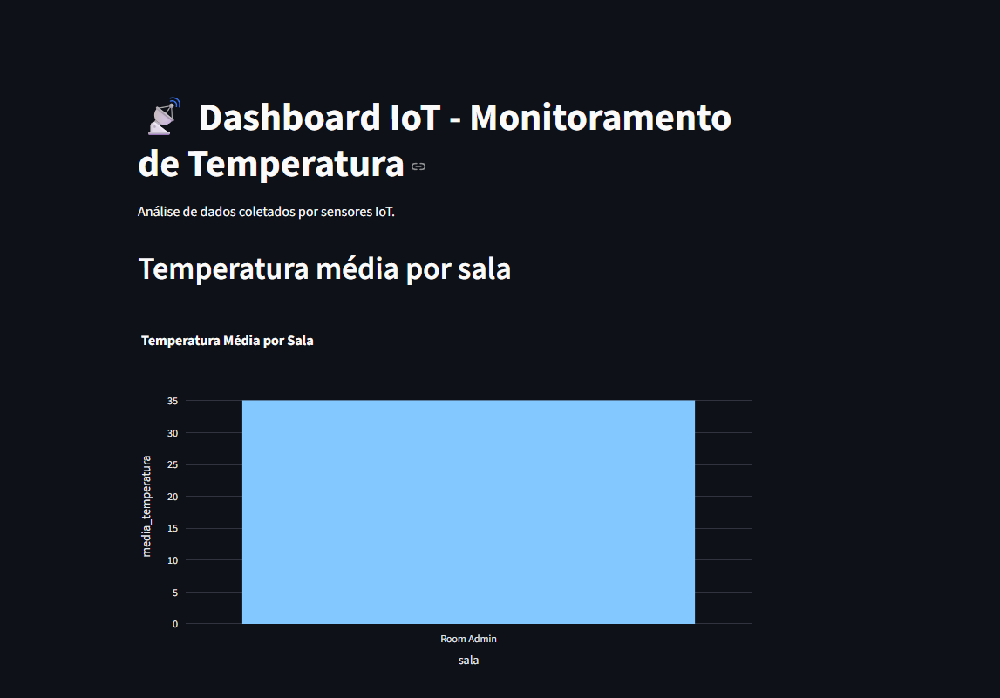
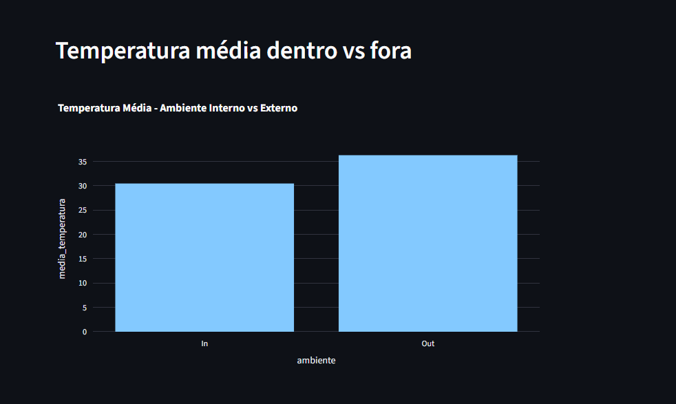
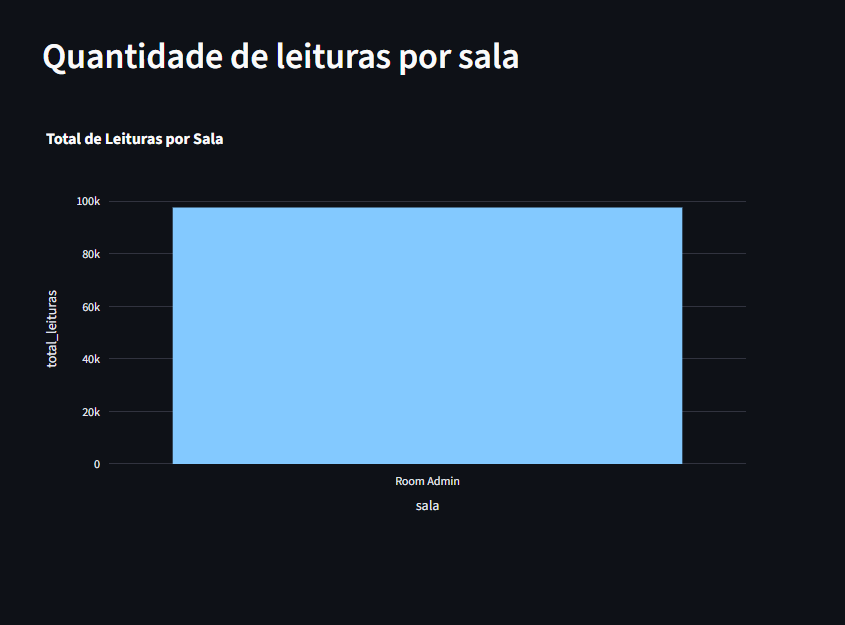

# IoT Temperature Monitoring Pipeline

## 📌 Sobre o projeto

Neste projeto eu desenvolvi um pipeline de dados para monitoramento de
temperatura utilizando dados simulados de sensores IoT.

O objetivo foi demonstrar o processo completo de ingestão,
armazenamento, processamento e visualização de dados utilizando
ferramentas modernas de engenharia de dados.

------------------------------------------------------------------------

## 🧰 Tecnologias utilizadas

-   Python
-   PostgreSQL
-   Docker
-   Streamlit
-   Pandas
-   SQLAlchemy

------------------------------------------------------------------------

## ⚙️ Arquitetura do projeto

O fluxo do projeto segue as seguintes etapas:

1.  Coleta de dados de sensores IoT a partir de um dataset CSV\
2.  Processamento e ingestão dos dados com Python\
3.  Armazenamento em banco de dados PostgreSQL executando em container
    Docker\
4.  Criação de views SQL para análise dos dados\
5.  Visualização das informações em um dashboard web com Streamlit

------------------------------------------------------------------------

## 🐳 Execução do banco de dados

Para executar o banco de dados PostgreSQL foi utilizado Docker.

``` bash
docker run --name postgres-iot \
-e POSTGRES_PASSWORD=123456 \
-e POSTGRES_USER=iotuser \
-e POSTGRES_DB=iotdb \
-p 5432:5432 \
-d postgres
```

------------------------------------------------------------------------

## 🚀 Execução do pipeline

Para carregar os dados no banco:

``` bash
python pipeline.py
```

O script realiza:

-   leitura do dataset\
-   tratamento dos dados\
-   inserção no PostgreSQL

------------------------------------------------------------------------

## 📊 Dashboard

O dashboard foi desenvolvido com Streamlit para visualização interativa
das informações.

Para executar:

``` bash
streamlit run dashboard.py
```

O sistema gera gráficos como:

-   temperatura média por sala\
-   temperatura média interna vs externa\
-   quantidade de leituras por ambiente

------------------------------------------------------------------------

## 📷 Exemplos do sistema

### Pipeline executando



------------------------------------------------------------------------

### Banco de dados PostgreSQL



------------------------------------------------------------------------

### Dashboard Streamlit







------------------------------------------------------------------------

## 🎯 Conclusão

Este projeto demonstra um pipeline completo de dados IoT, integrando
coleta, armazenamento, análise e visualização utilizando ferramentas
amplamente utilizadas no mercado de engenharia de dados.
